# bedrock-rag-eval

Containerized local RAG service for AWS Bedrock docs with ingestion, hybrid retrieval, grounded answers with citations, and evaluation using RAGAS + DeepEval.

## Important note: 

The full implementation (core requirements + bonus) was completed within ~36 hours. The goal was to deliver a functional MVP with clear architecture and documented limitations, leaving well-defined next steps for production hardening and quality improvements.

## Sources: 

To reflect a real-world scenario, I used a mixed corpus of PDF, TXT, and HTML documents as the knowledge sources.

## Requirement Coverage

| Requirement | Status | Evidence |
|---|---|---|
| Containerized full stack (`docker compose up`: app + vector DB) | Done | `docker-compose.yml` (`rag-api` + `chroma`), `Dockerfile` |
| Ingest Markdown / PDF / TXT | Done | `POST /ingest`, `app/ingest/loader.py` |
| Fixed-size chunking + local embeddings + ChromaDB | Done | `app/ingest/chunker.py`, `app/ingest/embedder.py`, `app/db/chroma.py` |
| REST API: `/health`, `/ingest`, `/query` | Done | `app/main.py` |
| Grounded answers with `doc_id` + `chunk_id` citations | Done | `app/generation/llm.py`, `app/main.py` |
| No-answer contract (`answer=null`, empty citations) | Done | `/query` response handling in `app/main.py` |
| Evaluation dataset (>=20 rows) | Done | `data/eval/eval_dataset.jsonl` (20 rows) |
| Metrics (Context Precision/Recall, Faithfulness, Relevancy, Correctness) via RAGAS + DeepEval | Done | `scripts/run_eval.py` |
| Evaluation report with aggregate + per-question + failure analysis + improvements | Done | `reports/eval_report.md` |
| README with architecture, setup, tradeoffs, limitations, improvements | Done | this file |
| Agentic research endpoint **(extra credit)** | Done | `POST /agent/research`, `app/agent/research.py` |

---

## Architecture

```mermaid
flowchart TB
    subgraph HOST["🖥️ HOST — Evaluation Layer"]
        EVAL["📊 scripts/run_eval.py"]
        EVAL -->|"RAGAS + DeepEval"| METRICS["ctx_precision · ctx_recall · faithfulness · relevancy · correctness"]
    end

    HOST -->|"HTTP"| DOCKER

    subgraph DOCKER["🐳 Docker Compose"]
        subgraph API["rag-api (FastAPI)"]
            INGEST["📥 /ingest — loader → chunker → embedder"]
            QUERY["🔍 /query — embed → hybrid → rerank → generate"]
            AGENT["🤖 /agent/research — sub-Qs → RAG loop → retry → synthesise"]
            STREAM["📡 /query/stream — SSE token streaming"]
            UI["🌐 /ui — web interface"]
        end

        subgraph CHROMA["ChromaDB 0.6.3"]
            VEC[("Cosine HNSW, persistent volume")]
        end

        subgraph MISTRAL["Mistral API (external)"]
            LLM["mistral-large-latest, mistral-small (fallback)"]
        end

        INGEST -->|"upsert embeddings"| VEC
        QUERY -->|"vector + BM25"| VEC
        QUERY -->|"generate + cite"| LLM
        AGENT -->|"internal /query"| QUERY
        AGENT -->|"synthesise"| LLM
    end

    style HOST fill:#1a1a2e,stroke:#e94560,color:#fff
    style DOCKER fill:#16213e,stroke:#0f3460,color:#fff
    style API fill:#0f3460,stroke:#533483,color:#fff
    style CHROMA fill:#1a472a,stroke:#2d6a4f,color:#fff
    style MISTRAL fill:#4a1942,stroke:#6b2d5b,color:#fff
```



### Data Flow

```mermaid
flowchart LR
    Q["❓ User Query"] --> EMB["1️⃣ Embed (all-MiniLM-L6-v2)"]
    EMB --> RET["2️⃣ Retrieve (60% vector + 40% BM25)"]
    RET --> RR["3️⃣ Rerank (cross-encoder, top-20 → top-4)"]
    RR --> GEN["4️⃣ Generate (Mistral LLM + citations)"]
    GEN --> GATE{"5️⃣ Confidence Gate"}
    GATE -->|"confident"| ANS["✅ Answer + citations"]
    GATE -->|"low confidence"| NULL["🚫 null (no hallucination)"]

    RET <-->|"cosine HNSW"| DB[("ChromaDB")]
    GEN <-->|"API call"| LLM["Mistral API"]

    style Q fill:#e94560,stroke:#333,color:#fff
    style ANS fill:#2d6a4f,stroke:#333,color:#fff
    style NULL fill:#c23616,stroke:#333,color:#fff
    style DB fill:#1a472a,stroke:#333,color:#fff
    style LLM fill:#4a1942,stroke:#333,color:#fff
```



### Agent Research Pipeline


---

## Tech Stack

- **Runtime / deployment**
  - Docker + Docker Compose
  - Python 3.11

- **API / application**
  - FastAPI + Uvicorn
  - Pydantic v2
  - `python-dotenv` (environment configuration)

- **Ingestion / retrieval**
  - ChromaDB (separate containerized vector DB service)
  - `sentence-transformers/all-MiniLM-L6-v2` (local embeddings)
  - `pypdf` (PDF parsing)
  - Hybrid retrieval with **custom in-repo BM25 implementation** (no external BM25 package)
  - Optional reranking (local cross-encoder, optional Cohere provider)

- **Generation / LLM**
  - Mistral API (primary provider; optional for generation and judge mode)
  - OpenAI Python SDK (used with Mistral's OpenAI-compatible endpoint)

- **Evaluation**
  - RAGAS
  - DeepEval
  - Hugging Face `datasets`
  - `langchain-openai` (evaluation integration)

- **Testing / utilities**
  - Pytest
  - `httpx` (client calls in scripts and checks)

---

## Project Structure

```text
app/
  main.py                 API endpoints and query pipeline
  config.py               env/config management
  ingest/
    loader.py             load .md/.pdf/.txt and clean text
    chunker.py            fixed-size chunking with overlap
    embedder.py           local embeddings
  db/chroma.py            Chroma persistence + retrieval helpers
  retrieval/              hybrid retrieval, rerank, multihop, cache
  generation/llm.py       Mistral prompting + citation extraction
  agent/research.py       auto-research agent (sub-question → RAG → synthesis)
scripts/
  run_eval.py             end-to-end evaluation runner
  smoke_ingest.sh         ingestion smoke script
  smoke_query.sh          query smoke script
  smoke_agent_research.sh agent research smoke script
data/
  corpus_raw/             source docs
  eval/eval_dataset.jsonl evaluation dataset (20 rows)
reports/                  generated eval outputs
```

---

## Setup (Fresh Machine)

### 1) Configure environment

```bash
cp .env.example .env
```

Set at least:

```env
MISTRAL_API_KEY=...   # optional for LLM generation/judge mode
```

Secrets are loaded from `.env`; do not commit `.env`.

### 2) Start service

```bash
docker compose up --build -d
```

This starts:
- `rag-api` at `http://localhost:8000`
- `chroma` at `http://localhost:8001`

### 3) Ingest corpus

```bash
curl -s -X POST http://localhost:8000/ingest \
  -H "Content-Type: application/json" \
  -d '{"path":"data/corpus_raw"}' | python3 -m json.tool
```

### 4) Health check

```bash
curl -s http://localhost:8000/health | python3 -m json.tool
```

---

## API

### `GET /health`

Returns service and Chroma/LLM readiness.

### `POST /ingest`

Request:

```json
{"path":"data/corpus_raw"}
```

Response fields:
- `docs_total`, `docs_ok`, `docs_failed`
- `chunks_total`, `chunks_indexed`
- `duration_sec`
- `errors` (max 10)

### `POST /query`

Request:

```json
{"question":"What is Amazon Bedrock?","top_k":4,"include_context":true}
```

Response:

```json
{
  "answer":"...",
  "citations":[{"doc_id":"...","chunk_id":"..."}],
  "retrieved":[{"doc_id":"...","chunk_id":"...","score":0.0,"text":"..."}]
}
```

**No-answer contract**

If the question is not answerable from corpus:

```json
{"answer":null,"citations":[]}
```

### Additional endpoints

- `POST /agent/research` (auto-research agent — see below)
- `POST /query/stream` (SSE streaming)
- `GET /stats` (collection stats)
- `POST /cache/clear`
- `GET /ui` (simple local web UI)

---

## Agentic Research Endpoint (Extra Credit)

`POST /agent/research` autonomously decomposes a broad topic into sub-questions,
queries the existing RAG pipeline for each, retries gaps with reformulated
questions, scores evidence quality, flags potential contradictions, and
synthesises a structured mini-report.

**Request:**

```json
{
  "topic": "Amazon Bedrock Knowledge Bases",
  "max_subquestions": 5,
  "include_context": true
}
```

**curl example (with context chunks):**

```bash
curl -s -X POST http://localhost:8000/agent/research \
  -H "Content-Type: application/json" \
  -d '{"topic": "Amazon Bedrock Knowledge Bases", "max_subquestions": 5, "include_context": true}' \
  | python3 -m json.tool
```

**Response fields:**

| Field | Description |
|---|---|
| `topic` | Original research topic |
| `subquestions` | Auto-generated sub-questions |
| `findings[]` | Per-sub-question results (see below) |
| `gaps[]` | Sub-questions with no answer or low evidence (after retry) |
| `final_summary` | LLM-synthesised summary (deterministic fallback if LLM unavailable) |
| `stats` | `answered_count`, `answered_after_retry_count`, `gap_count`, `avg_confidence` |
| `possible_conflicts[]` | Pairs of findings with potentially contradictory statements |

**Finding fields:**

| Field | Description |
|---|---|
| `subquestion` | The sub-question asked |
| `answer` | RAG answer (or `null` for gaps) |
| `citations` | `[{doc_id, chunk_id}]` |
| `status` | `answered` · `gap` · `answered_after_retry` |
| `contexts` | Retrieved chunks (populated when `include_context=true`) |
| `attempts` | 1 (initial only) or 2 (retried) |
| `retried_subquestion` | Reformulated question used for retry (`null` if not retried) |
| `retry_resolved` | `true` if retry turned a gap into an answer |
| `confidence` | Evidence quality score `[0.0, 1.0]` |
| `citation_count` | Number of citations |
| `unique_docs` | Number of distinct source documents cited |

**Design decisions:**

- **Sub-question generation** — template-based, deterministic, no extra LLM call.
- **Internal RAG calls** — reuses `/query` pipeline directly (no HTTP round-trip).
- **Gap-driven retry** — each gap is retried once with a deterministic reformulation
  (strip interrogative prefix, prepend directive). If the retry succeeds (non-null answer
  with citations), the finding status becomes `answered_after_retry`.
- **Evidence quality** — deterministic formula: `min(citations/3, 1) × 0.6 + min(unique_docs/2, 1) × 0.4`.
  Null answers get confidence `0.0`. Clamped to `[0, 1]`.
- **Contradiction flagging** — lightweight keyword-opposition heuristic comparing pairs of
  answered findings. Checks for term pairs like *required/optional*, *supported/not supported*,
  *enabled/disabled*. Conservative to avoid false positives.
- **Summary synthesis** — LLM when available, deterministic fallback otherwise.
  Both treat `answered_after_retry` findings as answered.

---

## Ingestion + Indexing Design

### Deterministic IDs

- `doc_id`: relative path from ingest root
- `chunk_id`: `<doc_id>#<chunk_index:05d>`

### Stored metadata per chunk

- `doc_id`
- `chunk_id`
- `source_path`
- `content_type`
- `chunk_index`

### Idempotency

Upserts use deterministic `chunk_id` and clean stale IDs per `doc_id`, so re-ingest does not create duplicates.

---

## Retrieval + Generation Design Decisions (Tradeoffs)

1. **Fixed-size chunking (char-based)**
   - Chosen for predictable behavior and fast MVP.
   - Tradeoff: semantic boundaries are imperfect.

2. **Hybrid retrieval (vector + BM25)**
   - Improves precision on keyword-heavy technical questions.
   - Tradeoff: more tuning complexity (weights, diversity caps).

3. **Optional reranking**
   - Improves ordering quality for hard queries.
   - Tradeoff: extra latency and model load.

4. **Strict no-answer contract**
   - Prioritizes hallucination resistance.
   - Tradeoff: can return null on borderline answerable rows.

5. **Citation fallback**
   - If model omits chunk markers, API still returns grounded citations from retrieved chunks.

---

## Evaluation (Part 2)

### Dataset

- File: `data/eval/eval_dataset.jsonl`
- Total rows: 20
- Categories:
  - factual: 7
  - multi_hop: 4
  - paraphrase: 5
  - no_answer: 4

### Run evaluation

```bash
python3 scripts/run_eval.py \
  --dataset data/eval/eval_dataset.jsonl \
  --api-url http://localhost:8000 \
  --require-llm
```

### Generated artifacts

- `reports/eval_results.json`
- `reports/per_question_results.csv`
- `reports/eval_report.md`

### Latest aggregate (judge mode)

From `reports/eval_report.md`:
| Metric | Score |
|---|---|
| Context Precision | 0.6111 |
| Context Recall | 0.7028 |
| Faithfulness | 0.8500 |
| Answer Relevancy | 0.6104 |
| Answer Correctness | 0.7061 |

---

## AI-Assisted Workflow (what was done)

- Iterative branch-based implementation (ingest -> query -> eval -> retrieval tuning).
- Prompt-driven decomposition into small verifiable deliverables.
- Frequent re-evaluation after targeted retrieval/generation changes.
- Test-backed refinements (query behavior and contracts validated with pytest).

### Iteration timeline (what changed and why)

1. **MVP-first build strategy**
   - Implemented `/ingest`, `/query`, `/health`, deterministic IDs, and citation contract first.
   - Priority was a working, inspectable baseline before adding optimizations.

2. **Retrieval + no-answer hardening**
   - Added hybrid retrieval, diversity controls, reranking hooks, and stricter fallback handling.
   - Explicitly enforced `answer=null` + empty citations for no-answer behavior.

3. **Provider evolution (Groq -> Mistral)**
   - Early iterations explored Groq during rapid prototyping.
   - Final implementation standardized on **Mistral** to match current task constraints and keep one provider path for generation + judge-mode evaluation.
   - API keys remained env-driven (`.env`, `.env.example`), never hardcoded.

4. **Evaluation maturity (heuristic -> judge mode)**
   - Started with heuristic checks to unblock iteration speed.
   - Upgraded to judge-backed RAGAS + DeepEval to get stricter faithfulness/relevancy/correctness signals.
   - Failure analysis from eval results directly informed retrieval and dataset adjustments.

5. **Agent evolution**
   - Initial extra-credit version: sub-question decomposition + report synthesis.
   - Extended to single retry for gaps, evidence confidence scoring, contradiction hints, and optional context exposure for audit/debug (`include_context=true`).
   - Added dedicated tests to keep this behavior stable.

### What this demonstrates

- AI was used as an **engineering accelerator**, not a black box:
  - decomposition into small deliverables,
  - measurable checkpoints (tests + eval reruns),
  - iterative correction when regressions appeared.

---

## Why This Project Is Useful In Real-World Deployment

1. **Grounded internal assistant with auditability**
   - Answers include chunk-level citations (`doc_id`, `chunk_id`) so teams can verify claims quickly.
   - Useful for internal support, docs operations, and engineering enablement.

2. **Safer behavior under uncertainty**
   - Strict no-answer contract prevents fabricated answers when evidence is missing.
   - This is especially important for regulated or high-trust workflows.

3. **Built-in quality loop**
   - Evaluation pipeline (dataset + RAGAS + DeepEval + report) enables repeatable regression checks.
   - Teams can compare runs before/after retrieval/model/config changes.

4. **Low operational friction**
   - Full stack is containerized (`rag-api` + `chroma`) and runs locally.
   - Env-driven config and modular app structure allow straightforward transition to VM/K8s setups.

5. **Agent endpoint solves practical research tasks**
   - `/agent/research` transforms one broad topic into a structured, evidence-backed mini-report with:
     - answered findings,
     - unresolved gaps,
     - confidence signals,
     - possible contradictions.
   - This is directly useful for analysts, architects, and support teams who need fast scoped research from a known corpus.

---

## Known Limitations

1. Judge metrics can vary run-to-run because they depend on LLM scoring.
2. Fixed-size chunking with markdown-header splitting can still break mid-paragraph for very dense sections.
3. Some evaluation rows remain sensitive to retrieval ranking noise (e.g., Q15 runtime-metrics regression).
4. Agent sub-question generation is template-based; an LLM-driven decomposition would yield more targeted questions.
5. BM25 index is rebuilt fully on each ingest; large corpora may cause a brief delay.

---

## What I Would Improve With More Time

1. Add parent-document retrieval: store small chunks for matching but pass the full parent section as context to the LLM.
2. Add LLM-based query rewriting (HyDE or step-back prompting) for ambiguous or complex questions.
3. Upgrade agent sub-question generation from templates to LLM-driven decomposition with follow-up loops.
4. Add deterministic CI pipeline for regression checks (ingest smoke + eval smoke on every PR).

---

## Hardware / Runtime Expectations

Runs on:
- 16 GB RAM
- 4+ CPU cores
- ~20 GB disk
- No GPU required

---

## Useful Commands

```bash
# Start
docker compose up --build -d

# Ingest
./scripts/smoke_ingest.sh

# Query smoke test
./scripts/smoke_query.sh

# Agent research smoke test
./scripts/smoke_agent_research.sh

# Unit tests
python3 -m pytest -q tests/

# Eval
python3 scripts/run_eval.py --dataset data/eval/eval_dataset.jsonl --api-url http://localhost:8000 --require-llm
```
